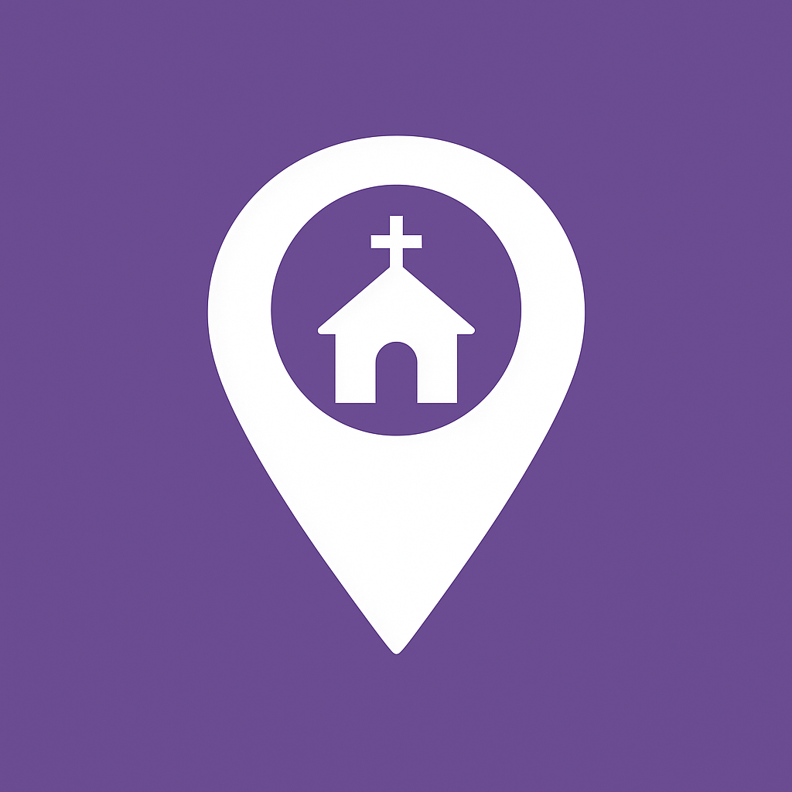

<div align="center">
  
  
  # Via Fidei
  
  **Igrejas Católicas de Maceió/AL**
  
  [](https://nextjs.org/)
  [](https://react.dev/)
  [](https://www.typescriptlang.org/)
  [](https://tailwindcss.com/)
  
  Uma aplicação web simples e objetiva para encontrar igrejas católicas em Maceió/AL
  
  [Demo](https://viafidei.vercel.app) • [Reportar Bug](https://github.com/matheusmcz/via-fidei/issues)
</div>

---

## 📋 Sobre o Projeto

Via Fidei é uma aplicação web desenvolvida para facilitar a busca de igrejas católicas apostólicas romanas em Maceió, Alagoas. O projeto oferece uma interface limpa e intuitiva para visualizar informações sobre paróquias da cidade.

### ✨ Funcionalidades

- 🔍 **Busca em tempo real** - Encontre igrejas por nome (ignora acentos)
- 📍 **Filtro por bairro** - Localize paróquias em bairros específicos
- 📱 **Design responsivo** - Interface mobile-first otimizada
- ⚡ **Performance** - SSR com Next.js 15 e Turbopack
- 🎨 **UI moderna** - Componentes do shadcn/ui
- 🔗 **Detalhes completos** - Página individual para cada igreja
- 📊 **Analytics** - Vercel Analytics integrado

## 🚀 Tecnologias

### Core

- **[Next.js 15](https://nextjs.org/)** - Framework React com App Router
- **[React 19](https://react.dev/)** - Biblioteca UI
- **[TypeScript](https://www.typescriptlang.org/)** - Tipagem estática

### Estilização

- **[Tailwind CSS](https://tailwindcss.com/)** - Framework CSS utility-first
- **[shadcn/ui](https://ui.shadcn.com/)** - Componentes reutilizáveis

### Ferramentas

- **[Vercel Analytics](https://vercel.com/analytics)** - Analytics (plano gratuito)
- **[Turbopack](https://turbo.build/pack)** - Bundler ultra-rápido

## 📦 Instalação

### Pré-requisitos

- Node.js 18.19+ ou 20+
- npm ou yarn

### Clone e instale

```bash
# Clone o repositório
git clone https://github.com/matheusmcz/via-fidei.git

# Entre no diretório
cd via-fidei

# Instale as dependências
npm install

# Inicie o servidor de desenvolvimento
npm run dev
```

Acesse [http://localhost:3000](http://localhost:3000) no navegador.

## 🛠️ Scripts Disponíveis

```bash
# Desenvolvimento com Turbopack
npm run dev

# Build de produção
npm run build

# Iniciar servidor de produção
npm run start

# Linting
npm run lint
```

## 📁 Estrutura do Projeto

```
via-fidei/
├── app/                      # App Router do Next.js
│   ├── igreja/[slug]/        # Página de detalhes (dinâmica)
│   ├── layout.tsx            # Layout raiz
│   ├── page.tsx              # Página inicial
│   └── globals.css           # Estilos globais
├── components/               # Componentes compartilhados
│   └── ui/                   # Componentes shadcn/ui
├── features/                 # Features organizadas por domínio
│   └── churches/             # Feature de igrejas
│       ├── church-card.tsx   # Card de igreja
│       ├── church-list.tsx   # Lista com filtros
│       └── use-church-filters.ts  # Hook de busca/filtro
├── data/                     # Dados estáticos
│   └── churches.ts           # 55 igrejas de Maceió
├── lib/                      # Utilitários
│   └── utils/
│       ├── cn.ts             # Merge de classes CSS
│       └── slugify.ts        # Geração de slugs
├── types/                    # Definições TypeScript
│   └── church.ts             # Interface Church
└── public/                   # Assets estáticos
    └── images/               # Imagens e logos
```

## 🎨 Componentes Principais

### ChurchCard

Componente de card para exibir informações resumidas da igreja.

### ChurchList

Lista de igrejas com busca e filtros integrados.

### useChurchFilters

Hook customizado para gerenciar busca, filtro e ordenação.

## 📊 Dados

O projeto utiliza dados reais de **55 igrejas católicas** de Maceió/AL, coletados do site [Hora da Missa](https://www.horadamissa.com).

### Estrutura de dados

```typescript
interface Church {
  id: string;
  name: string;
  slug: string; // URL-friendly
  address: string;
  district: string;
  imageUrl?: string; // Opcional
}
```

## 🎯 SEO

- ✅ Metadata dinâmica por página
- ✅ Open Graph para redes sociais
- ✅ Twitter Cards
- ✅ Sitemap automático
- ✅ SSR para melhor indexação

## 🚢 Deploy

### Vercel (Recomendado)

[](https://vercel.com/new/clone?repository-url=https://github.com/matheusmcz/via-fidei)

1. Conecte seu repositório GitHub
2. Configure o projeto (detecção automática)
3. Deploy!

### Outras plataformas

O projeto é compatível com qualquer plataforma que suporte Next.js:

- Netlify
- Railway
- Render
- AWS Amplify

## 📝 Licença

Este projeto está sob a licença MIT. Veja o arquivo [LICENSE](LICENSE) para mais detalhes.

## 👨‍💻 Autor

**Matheus Vieira do Nascimento**

- 📧 Email: [matheusmczvieira@gmail.com](mailto:matheusmczvieira@gmail.com)
- 🐙 GitHub: [@matheusmcz](https://github.com/matheusmcz)
- 💼 LinkedIn: [Matheus Nascimento](https://www.linkedin.com/in/matheusmcz)

Católico - Maceioense - Marido - Pai - Desenvolvedor

## 🙏 Agradecimentos

- Dados fornecidos por [Hora da Missa](https://www.horadamissa.com)
- Componentes UI por [shadcn/ui](https://ui.shadcn.com)
- Arquidiocese de Maceió

---

<div align="center">
  Feito com carinho para a comunidade católica de Maceió
</div>
